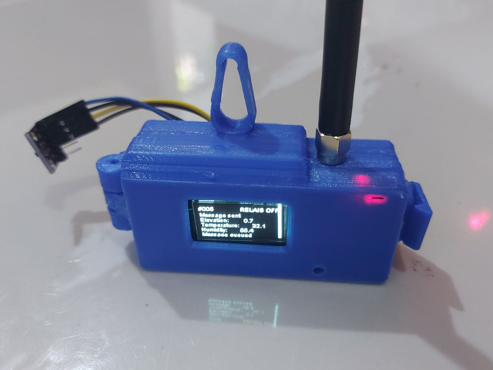
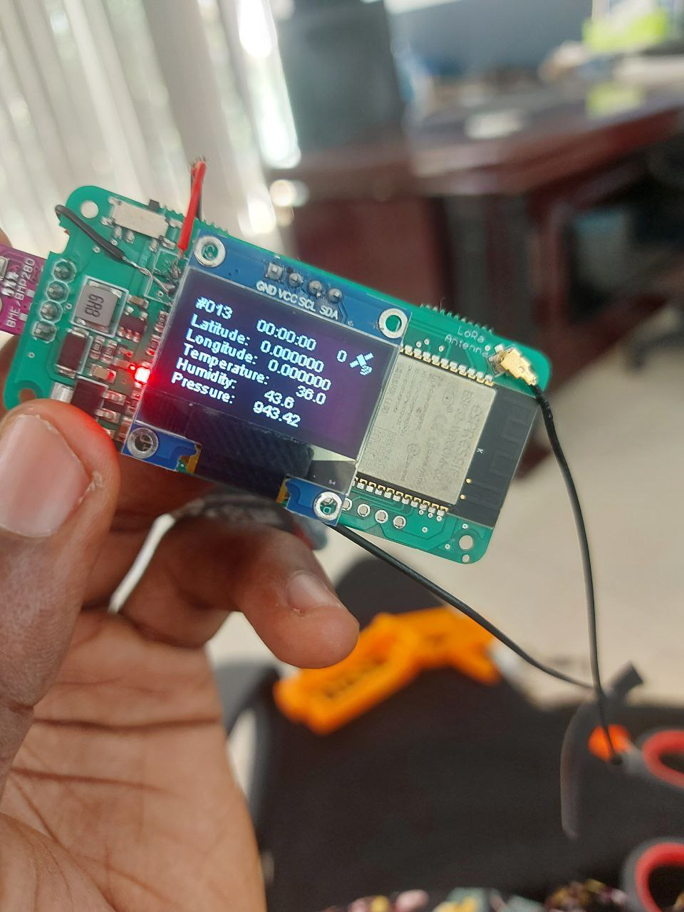
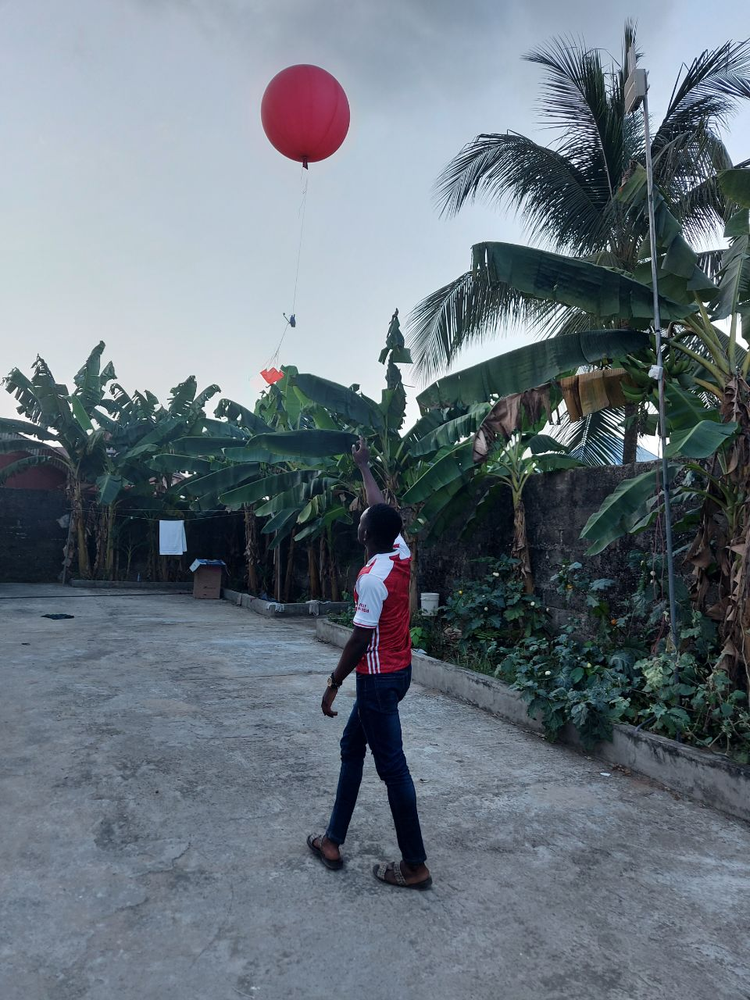

# Radiosonde
Collection of tools for DIY Weather Balloons and Forecasting

For Kanda Weather (Africa) and AscensionWx (U.S.), and open under MIT license.

|  TTGO LoRa32 v2.1     |     Cybaart Kanda Aeolus   |     KandaWeather Launch 
:-------------------------:|:-------------------------:|:-------------------------:
|   |   |   |

Components:
- Hardware
- 3d print files
- Firmware
- LoRaWAN decoders
- Node-red flow files
- Blockchain Smart contract

- Forecasting Dashboard
- Machine Learning Datasets

